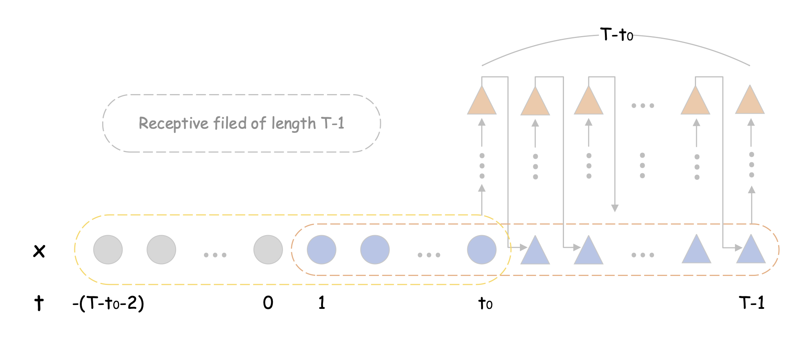

# Generative weather for improved crop model simulations

A preprint is to be on arXiv. The code was tested under Python `3.11.5`, PyTorch `2.2.0` and NumPy `1.26.3`.

- `train.py`: training
- `weather.py`: weather sampling
- `apsim1.py`: APSIM simulations for Scenario 1
- `apsim2.py`: APSIM simulations for Scenario 2

`train.py` can run on Apple silicon GPUs using Metal Performance Shaders (MPS). It seems weight initialisation (and possibly many others) in PyTorch is different from one when using CUDA. So you may not get the same results even with the same random seed. My impression is that RTX 3060 is 2-3 times faster than M3 Pro with 14-core GPU (in MacBook Pro).

**Abstract** 
Accurate and precise crop yield prediction is invaluable for decision making at both farm levels and regional levels. To make yield prediction, crop models are widely used for their capability to simulate hypothetical scenarios. While accuracy and precision of yield prediction critically depend on weather inputs to simulations, surprisingly little attention has been paid to preparing weather inputs. We propose a new method to construct generative models for long-term weather forecasts and ultimately improve crop yield prediction. We demonstrate use of the method in two representative scenarios—single-year production of wheat, barley and canola and three-year production using rotations of these crops. Results show significant improvement from the conventional method, measured in terms of mean and standard deviation of prediction errors. Our method outperformed the conventional method in every one of 18 metrics for the first scenario and in 29 out of 36 metrics for the second scenario. For individual crop modellers to start applying the method to their problems, technical details are carefully explained, and all the code, trained PyTorch models, APSIM simulation files and result data are made available.

&nbsp;

